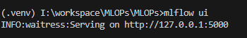
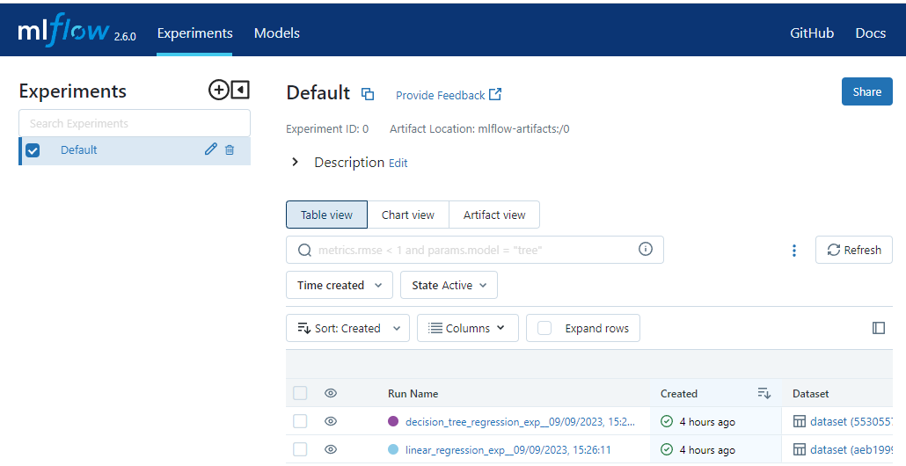
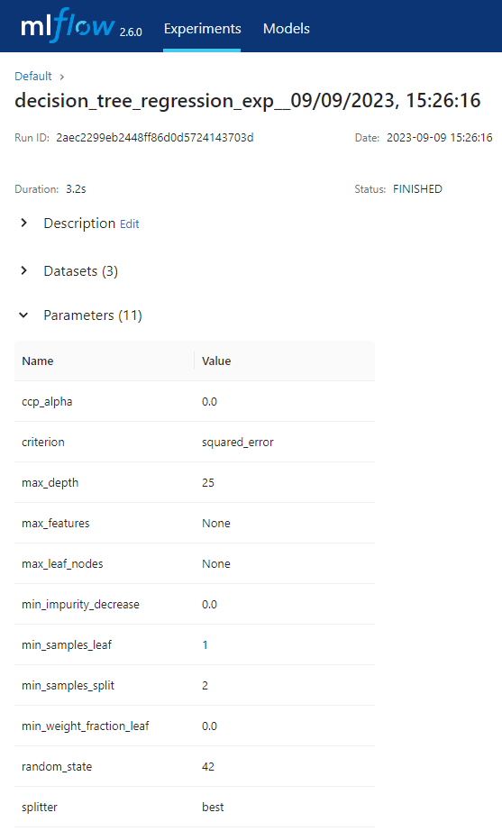
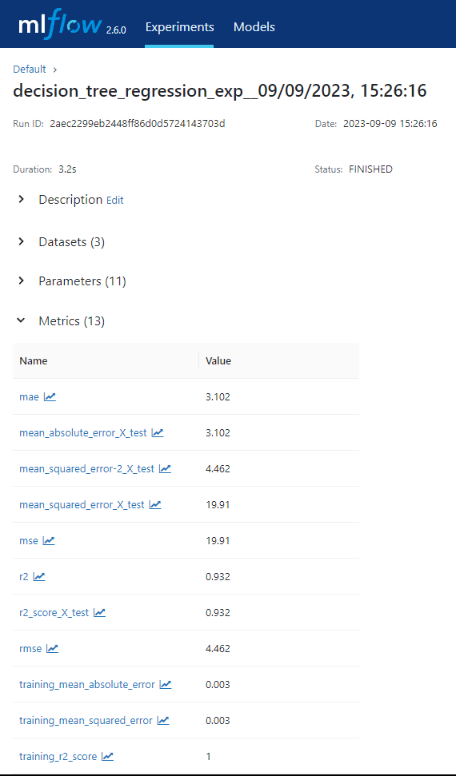
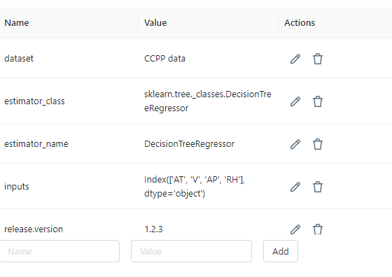

# To install MLflow 
pip install mlflow

# To start MLflow server
In the terminal window run the following command to start server locally
mlflow ui
or
mlflow server --default-artifact-root ./mlruns --host 127.0.0.0 --port 5000

Should see the following


go to http://127.0.0.1:5000 to verify that service is running



Make sure that you add the following to your code
```
# enable mlflow autologging
import mlflow

mlflow.set_tracking_uri('http://127.0.0.1:5000')
mlflow.sklearn.autolog(disable=False,
                       log_models=True,
                       log_datasets=True)
```
Few important points here
1. mflow is configured to autolog for the sklearn library; please modify it if you are using a different library. Also, if you include this code line 
```mlflow.sklearn.autolog```, logging will be enabled by default. I have exposed it simply as a reminder.
1. log_models is set to True
        basically we are asking MLflow to log this model as an artifact. Technically its not needed if you have all the parameters and other info captured, but certainly nice-to-have
1. log_datasets is set to True
        log dataset information/details (>really helpful)

# Experiments 

As i build models and train them, I use MLflow to keep track of parameters, metrics and other useful information thus comes the experiment. 

As per official documentation ">Each experiment lets you visualize, search, and compare runs, as well as download run artifacts or metadata for analysis in other tools. Experiments are maintained in a ... MLflow tracking server."

Let us see what it means


## Datasets


## Parameters



## Metrics



## Tags

They are helpful and user-friendly when you want to save additional metadata—essentially allowing you to add and save whatever you believe might be useful for recreating an experiment!
```
# set tags - adding metadata about the model
tags = {"team": "Engineering Team Name",
        "dataset": "CCPP model",
        "release.version": "1.2.3",
        "inputs": X_train.columns,
        "target": "PE"}
```




## Artifacts
]


## Model

Per official documentation ">An MLflow Model is a standard format for packaging machine learning models that can be used in a variety of downstream tools"