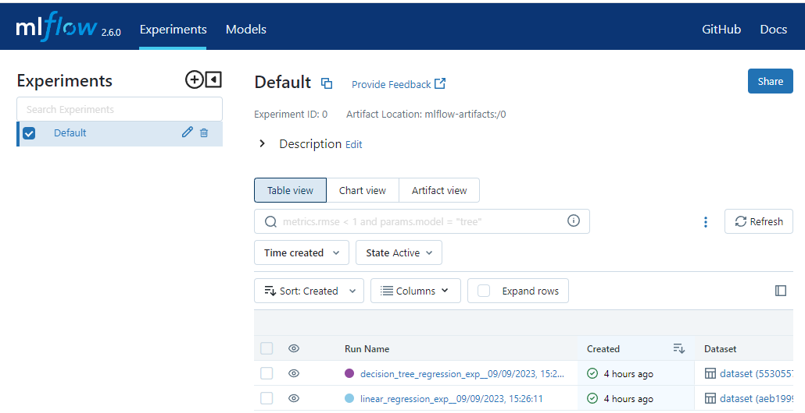
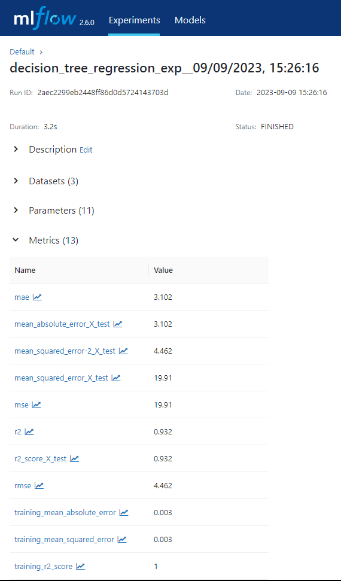
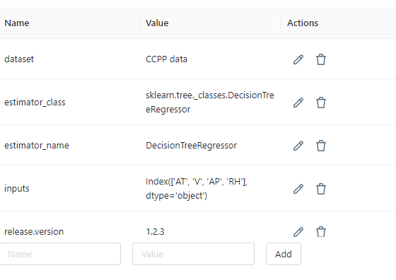
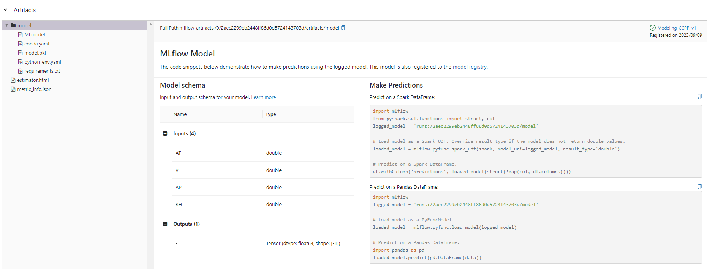

# To install MlFlow 
pip install mlflow

# To start MlFlow server
Run the following command
mlflow ui
or
mlflow server --default-artifact-root ./mlruns --host 127.0.0.0 --port 5000

go to http://127.0.0.1:5000
and verify that service is running

# Experiments 

As i build models and train them, i started to use MlFlow to keep track of parameters, metrics and other useful information

Let us see what I mean

## Datasets

## Parameters

## Metrics

## Tags

## Artifacts
