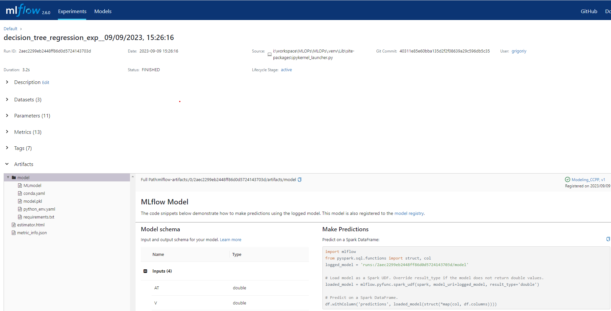
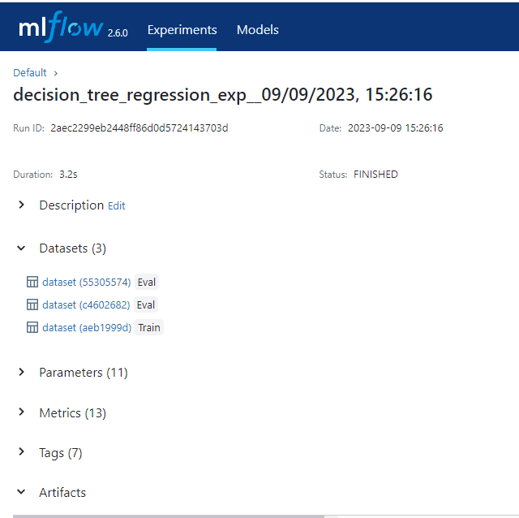

# To install MlFlow 
pip install mlflow

# To start MlFlow server
Run the following command
mlflow ui
or
mlflow server --default-artifact-root ./mlruns --host 127.0.0.0 --port 5000

go to http://127.0.0.1:5000
and verify that service is running


add the following to your code
```
# enable mlflow autologging
import mlflow

mlflow.set_tracking_uri('http://127.0.0.1:5000')
mlflow.sklearn.autolog(disable=False,
                       log_models=True,
                       log_datasets=True)
```
Few important points
1. mflow is set to autolog for sklearn library - modify if use some other library
1. log_models is set to True
1. log_datasets is set to True

# Experiments 

As i build models and train them, i started to use MlFlow to keep track of parameters, metrics and other useful information

Let us see what I mean



## Datasets


## Parameters


## Metrics


## Tags

They are helpful and user-friendly when you want to save additional metadata—essentially allowing you to add and save whatever you believe might be useful for recreating an experiment!
```
# set tags - adding metadata about the model
tags = {"team": "Engineering Team Name",
        "dataset": "CCPP model",
        "release.version": "1.2.3",
        "inputs": X_train.columns,
        "target": "PE"}
```


## Artifacts
