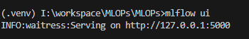
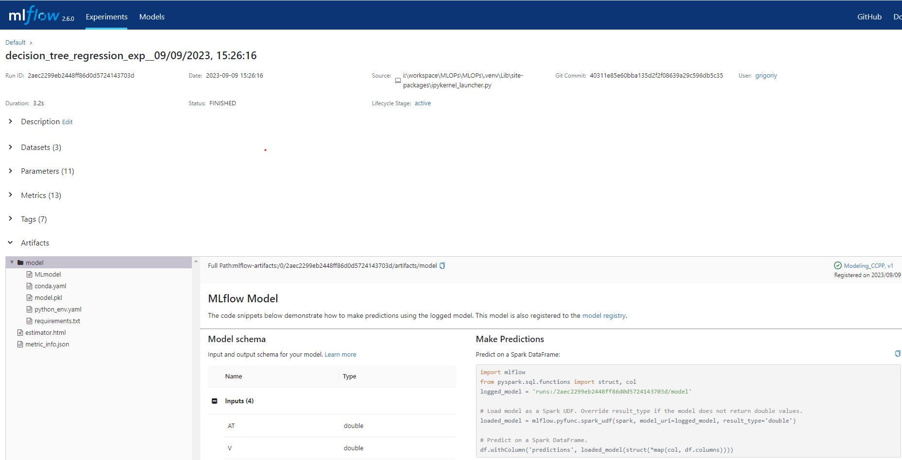
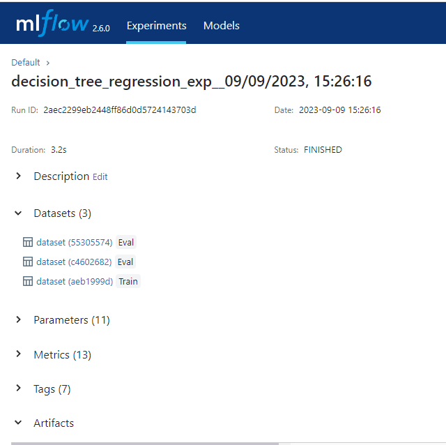

# Experiment with training a model using Linear Regression and using MLflow

# To install MLflow 
pip install mlflow

# To start MLflow server
In the terminal window run the following command to start server locally
mlflow ui
or
mlflow server --default-artifact-root ./mlruns --host 127.0.0.0 --port 5000

Should see the following


go to http://127.0.0.1:5000 to verify that service is running


Make sure that you add the following to your code
```
# enable mlflow autologging
import mlflow

mlflow.set_tracking_uri('http://127.0.0.1:5000')
mlflow.sklearn.autolog(disable=False,
                       log_models=True,
                       log_datasets=True)
```
Few important points here
1. mflow is configured to autolog for the sklearn library; please modify it if you are using a different library. Also, if you include this code line 
```mlflow.sklearn.autolog```, logging will be enabled by default. I have exposed it simply as a reminder.
1. log_models is set to True
        basically we are asking MLflow to log this model as an artifact. Technically its not needed if you have all the parameters and other info captured, but certainly nice-to-have
1. log_datasets is set to True
        log dataset information/details (> really helpful)

### MLflow limitations

**Major** MLflow does not support tracking usage of system resources like GPU, CPU, and memory. You'd have to add that logic into your application, and persist the data as metrics with log_metric or as a log file with log_artifact.

# Experiments 

As I build models and train them, I use MLflow to keep track of parameters, metrics and other useful information thus comes the experiment. 

As per official documentation "> Each experiment lets you visualize, search, and compare runs, as well as download run artifacts or metadata for analysis in other tools. Experiments are maintained in a ... MLflow tracking server."

Let us see what it means


on this screen you can see 
1. when each runs took place
1. status (success/fail)
1. datasets information
1. durations
1. sources (SOME_FILENAME.py)
1. model infos


## Datasets


### Datasets details 
You can further drill down into each dataset to see what datasets were used for training or evaluation and examine each if required.

Clicking on a dataset will provide you details such as
1. Purpose - eval/train
1. Number of rows and elements
1. Column list and the datatypes


## Parameters
Super helpful to track lots of parameters that you model might be using. 


## Metrics
Note: Might significantly vary depending on your model. 

I have chosen to use well-known metrics, but you can also add custom ones if needed!


## Tags

They are helpful and user-friendly when you want to save additional metadata—essentially allowing you to add and save whatever you believe might be useful for recreating an experiment!
```
# set tags - adding metadata about the model
tags = {"team": "Engineering Team Name",
        "dataset": "CCPP model",
        "release.version": "1.2.3",
        "inputs": X_train.columns,
        "target": "PE"}
```


## Artifacts
]


## Model

Per official documentation ">An MLflow Model is a standard format for packaging machine learning models that can be used in a variety of downstream tools"