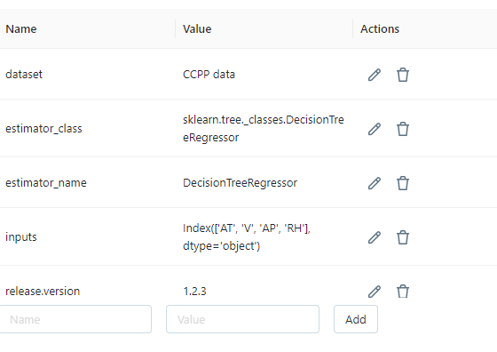

# Experiment with training a model using Linear Regression and using MLflow

Data science projects involve a myriad of tasks, from data preprocessing to model training and evaluation. Tracking and managing the experiments in these projects is crucial for maintaining transparency, reproducibility, and effective collaboration within a team. In this article, we'll explore how to experiment with training a machine learning model using Linear Regression and harness the power of MLflow, a versatile open-source platform for managing machine learning lifecycle.

# To install MLflow 
Before we dive into MLflow, ensure you have it installed. You can do this via pip:

```pip install mlflow```

# To start MLflow server
To start the MLflow server locally, open your terminal and execute either of the following commands:
mlflow ui
Or, if you prefer specifying additional configuration options:
mlflow server --default-artifact-root ./mlruns --host 127.0.0.0 --port 5000

You should see a confirmation message similar to the following:


go to http://127.0.0.1:5000 to verify that service is running


Don't forget to add the following code to your Python script to enable MLflow autologging:
```
# enable mlflow autologging
import mlflow

mlflow.set_tracking_uri('http://127.0.0.1:5000')
mlflow.sklearn.autolog(disable=False,
                       log_models=True,
                       log_datasets=True)
```
Here's a breakdown of the important settings:

1. MLflow is configured to autolog for the sklearn library. Modify it if you are using a different library. Also, if you include this code line 
```mlflow.sklearn.autolog```, logging will be enabled by default. I have exposed it simply as a reminder.
1. log_models is set to True
        basically we are asking MLflow to log this model as an artifact. Technically its not needed if you have all the parameters and other info captured, but certainly nice-to-have
1. log_datasets is set to True
        log dataset information/details (> really helpful)

### MLflow limitations

**Major** It's important to note that MLflow has limitations, including the lack of built-in support for tracking system resource usage (e.g., GPU, CPU, memory). If you need to monitor these resources, you'll need to implement custom logic in your application and persist the data as metrics using log_metric or as log files using log_artifact

# Experiments: Tracking Progress and Results

As you build and train models, MLflow helps you keep track of parameters, metrics, and other vital information through experiments. Each experiment allows you to visualize, search, and compare runs, as well as download run artifacts or metadata for analysis in other tools.

Let us see what it means


On the experiments screen, you can see:
1. when each runs took place
1. status (success/fail)
1. datasets information
1. durations
1. sources (SOME_FILENAME.py)
1. model infos

Note: When you run MLflow, it will generate artifacts and store them in the /mlruns folder. We strongly recommend updating your .gitignore or .dockerignore files to properly exclude this folder from version control or containerization, as it can quickly accumulate large files and disrupt your project's organization.


## Datasets: A Closer Look


MLflow allows you to drill down into each dataset to see which datasets were used for training or evaluation. This detailed view provides information such as:

1. Purpose (e.g., eval/train).
1. Number of rows and elements.
1. Column list and data types.


## Parameters: Tracking Model Settings
Tracking various parameters your model uses can be super helpful. MLflow makes it easy to monitor and compare parameter settings across runs.


## Metrics: Evaluating Model Performance
The choice of metrics depends on your model, but MLflow supports a wide range of them. You can also add custom metrics if needed.

I have chosen to use well-known metrics, but you can also add custom ones if needed!


### Helpful Comparison charts 

We can see here the comparison for the last 4 runs 


## Tags: Adding Metadata

Tags are user-friendly metadata that you can add to experiments. They help you save additional information that might be useful for recreating an experiment.
```
# set tags - adding metadata about the model
tags = {"team": "Engineering Team Name",
        "dataset": "CCPP model",
        "release.version": "1.2.3",
        "inputs": X_train.columns,
        "target": "PE"}
```




## Artifacts: Storing Artifacts
In the context of data science experiments, artifacts encompass any files or data generated during the course of your project. MLflow adeptly handles the management and storage of these artifacts, simplifying both access and sharing. Moreover, MLflow offers sample code to assist you in this process, adding an invaluable layer of guidance to your workflow.
]


## Model: Packaging Machine Learning Models
In MLflow, an MLflow Model is a standardized format for packaging machine learning models. It can be used in a variety of downstream tools and environments.

By embracing MLflow in your data science projects, you can streamline your experimentation process, maintain a clear record of your work, and collaborate seamlessly with your team. Experimentation in data science becomes more efficient, organized, and reproducible with MLflow, ultimately helping you achieve better results and insights.